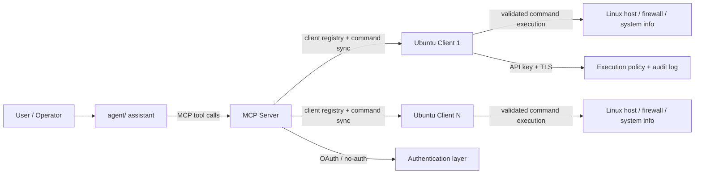

# ANAN Server Management Architecture

This repository implements a layered and policy-driven architecture for managing Linux command execution through an AI-assisted control plane. The system is intentionally split into three distinct layers: the assistant, the MCP orchestration layer, and the hardened execution node.

## 1. Overview

ANAN-SERVER-MGMT is designed around a central control model:

- the assistant handles reasoning and user interaction
- the MCP server manages routing, client registration, and command coordination
- the Ubuntu client is the enforcement boundary where commands are validated and executed under policy

This separation reduces risk and makes the system easier to audit, manage, and extend.

## 2. Solution components

```text
anan-server-mgmt/
├── agent/
│   ├── README.md
│   ├── config.json
│   ├── src/
│   │   ├── anan_agent.py
│   │   └── oauth.py
│   ├── tests/
│   └── start_anan_agent.sh
├── client/
│   └── ubuntu/
│       ├── README.md
│       ├── src/
│       │   ├── anan_client.py
│       │   ├── app.py
│       │   ├── audit.py
│       │   ├── config.py
│       │   ├── execution_policy.py
│       │   ├── policy_preflight.py
│       │   └── security.py
│       ├── tests/
│       ├── install_service.sh
│       ├── uninstall_service.sh
│       └── start_anan_client.sh
├── mcp_server/
│   ├── README.md
│   ├── anan_clients.json
│   ├── oauth_servers.json
│   ├── src/
│   │   └── anan_mcp_server/
│   │       └── server.py
│   ├── tests/
│   └── start_mcp_server.sh
├── ARCHITECTURE.md
├── ARCHITECTURE_DIAGRAM.md
├── EXECUTIVE_SUMMARY.md
├── TECHNICAL_ARCHITECTURE.md
└── .gitignore
```

## 3. Runtime architecture



## 4. Component responsibilities

### 4.1 Agent component

The agent layer is the user-facing and reasoning-driven component. It is responsible for:

- loading configuration from `config.json`
- selecting the LLM provider, such as Ollama or Gemini
- connecting to the MCP server over the configured transport
- issuing MCP commands to orchestrate work
- carrying user and caller identity metadata when needed
- supporting both no-auth and OAuth flows

This layer is designed to be a thin orchestration layer. It does not itself execute remote commands.

### 4.2 MCP server component

The MCP server is the central control plane for the system. It owns:

- client inventory
- command registry state
- routing logic for requests by client
- authentication mode selection
- OAuth validation when enabled
- synchronization of commands to managed clients
- read-only or non-admin tooling modes

It acts as the authority for all managed clients and defines the global command catalog used by the platform.

### 4.3 Ubuntu client component

The Ubuntu client is the hardened execution node. It is responsible for:

- accepting execution requests over a secure HTTP API
- validating API keys and protected access controls
- inspecting command names against allowlist policy
- blocking dangerous or disallowed binaries
- enforcing argument restrictions and timeout limits
- logging and auditing execution attempts
- returning structured success or failure responses

This is the final enforcement point in the architecture.

## 5. Trust boundaries

The platform explicitly separates concerns between three trust zones:

### Control plane
The MCP server is the control plane. It decides which clients exist and which commands are globally recognized.

### Execution plane
The Ubuntu client is the execution plane. It validates and executes commands only if they pass policy checks.

### Assistant plane
The assistant is the interface and reasoning layer. It is useful for operations, but it is not the runtime authority for command execution.

This is the most important architectural idea in the repository: command execution is never trusted to a higher-level component without local policy enforcement at the execution host.

## 6. Command lifecycle

A normal command flow is:

1. The user interacts with the assistant.
2. The assistant invokes an MCP tool.
3. The MCP server looks up the target client.
4. The server syncs registration information and command metadata as required.
5. The client validates the request against its execution policy.
6. The client executes the approved command with limits and safeguards.
7. Output is returned through the chain back to the user.

This pattern creates a clear and auditable chain of responsibility.

## 7. Security posture

The security model is intentionally conservative.

### Default-deny enforcement
Unknown commands are denied by default.

### No shell execution
Commands are executed via controlled argument handling, not a user-supplied shell string.

### Dangerous binary protections
The client blocks dangerous operations such as shutdown, reboot, service control, and file modification commands when they are not explicitly permitted.

### Policy file integrity
The runtime policy file must meet security requirements, including ownership and permissions checks.

### Auditing
The system records a trail of command execution and policy decisions.

## 8. Why this architecture works well

This architecture is effective because it divides responsibility cleanly across components:

- the assistant reasons about user intent
- the MCP server manages orchestration and state
- the client enforces runtime security

This structure makes the system easier to secure, easier to debug, and easier to scale to multiple remote Linux nodes without losing strict policy enforcement.

## 9. Recommended mental model

Think of ANAN-SERVER-MGMT as a three-layer security chain:

1. interaction layer
2. orchestration layer
3. enforcement layer

The assistant is useful, but it is not the final authority.
The MCP server is the routing authority.
The Ubuntu client is the enforcement authority.

That is the central architectural principle of the project.

## 10. Summary

ANAN-SERVER-MGMT is a distributed system built for secure, policy-controlled command execution across managed Linux endpoints. It combines AI-driven orchestration with centralized management and a hardened execution boundary, producing a system that is both operationally useful and security-conscious.
