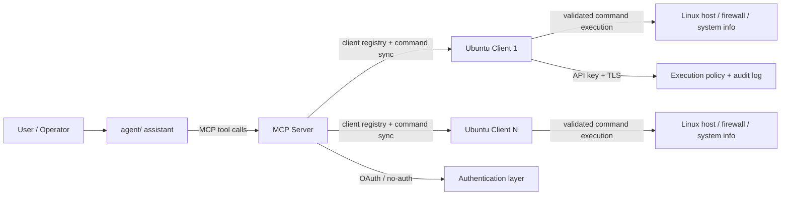

# ANAN Server Management Architecture Diagram

## Diagram meaning

- The assistant is the interaction layer.
- The MCP server is the coordination and routing layer.
- The Ubuntu client is the enforcement layer.
- The runtime host is the actual system being managed.

This diagram reflects the repo’s central design principle: the final command decision is always made at the execution node, not at the AI or orchestration layer.
