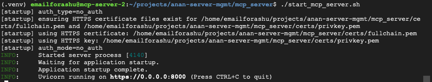
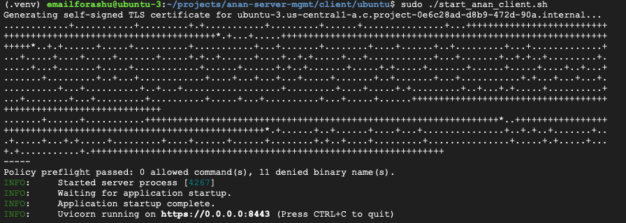
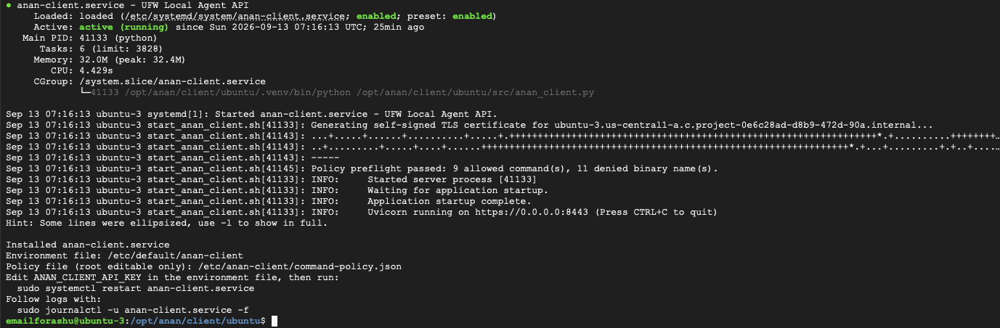
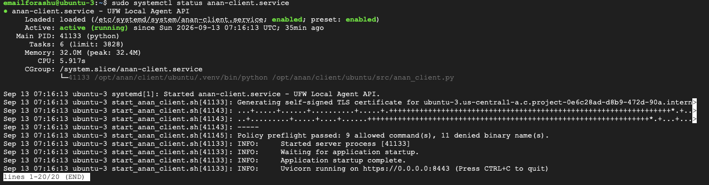
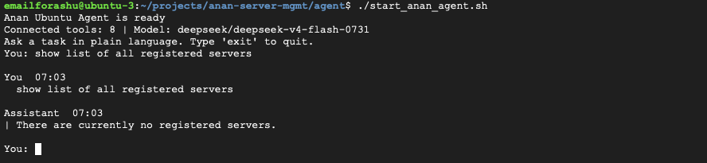
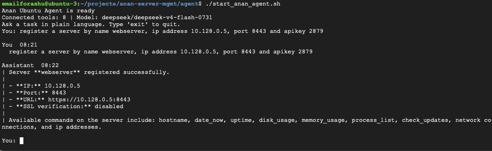
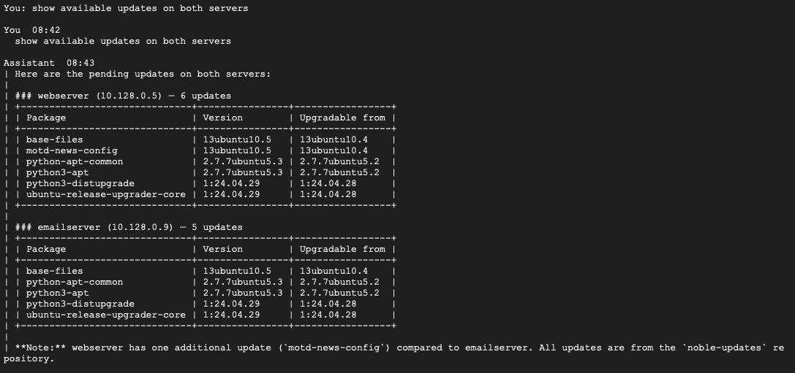
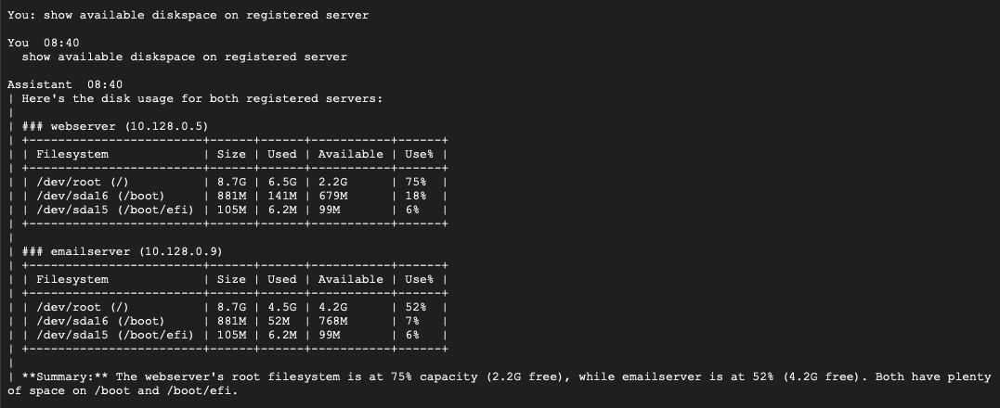
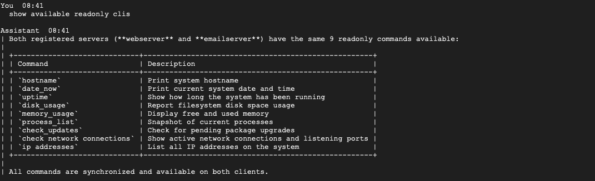

# Quick Start Guide

This quick guide gets you from zero to a running MCP server, one Ubuntu client (Agent), and an example command run. Keep it next to the repo root as `QUICK_START_GUIDE.md` for quick reference.

Prerequisites
- Python 3.12+
- OpenSSL (for dev certs)
- Shell access to the MCP host and Ubuntu client host

If you see the error about `ensurepip` or the virtual environment failing to create, install the system support packages first (Ubuntu/Debian). This Quick Start Guide contains per-component venv creation steps under `mcp_server`, `client/ubuntu`, and `agent`.

```bash
# Install system support for creating virtual environments and pip
sudo apt update
sudo apt install -y python3-venv python3-pip
# For a specific Python point release, install its venv package, e.g.:
sudo apt install -y python3.12-venv
# Verify pip is available:
python3 -m pip --version
```

If `pip` is not available on Ubuntu (you see `-bash: pip: command not found`), install the system pip package and use `python3 -m pip` for consistency:

```bash
sudo apt update
sudo apt install -y python3-pip
# verify
pip3 --version
# Recommended: use the interpreter-bound installer to avoid ambiguity
python3 -m pip install --upgrade pip
```

Get the code (clone to local machine)

If you see `-bash: git: command not found` on Ubuntu, install Git and retry the clone.

Ubuntu / Debian (install Git):

```bash
sudo apt update
sudo apt install -y git
git --version
```

If `git` still isn't found after installation, open a new shell or ensure `/usr/bin` is on your `PATH`.

Clone the repository and create a local working directory on your machine:

```bash
# create a projects directory (optional)
mkdir -p ~/projects
cd ~/projects
# clone the repo (example using your repo URL)
git clone https://github.com/ashudagr8/anan-server-mgmt.git anan-server-mgmt
cd anan-server-mgmt
```

Alternative: download the repository ZIP from GitHub and unzip it:

```bash
wget https://github.com/ashudagr8/anan-server-mgmt/archive/refs/heads/main.zip -O repo.zip
unzip repo.zip -d ~/projects
cd ~/projects/anan-server-mgmt-main
```
---

Key files
- Server config: `mcp_server/config/mcp_server_config.json`
- Client registry: `mcp_server/config/anan_clients.json`
- Agent config: `agent/config/config.json`

# 1. Install and start the MCP server

Before proceeding, ensure you completed the `Prerequisites` section above on the machine where you'll install the MCP server (Git, python3-venv, OpenSSL, etc.). For additional server details and configuration notes, see the [MCP server README](mcp_server/README.md).

```bash
cd mcp_server
# Create and activate a Python virtual environment (recommended):
python3 -m venv .venv
source .venv/bin/activate
python -m pip install -r requirements.txt
# create dev certs (dev only)
mkdir -p certs
openssl genrsa -out certs/privkey.pem 2048
openssl req -new -x509 -key certs/privkey.pem -out certs/fullchain.pem -days 365 -subj "/CN=localhost"
# ensure mcp_server/config/mcp_server_config.json enables https and points to the certs
./start_mcp_server.sh
```

The server exposes `/mcp/health` and MCP tools under `/mcp`. The client registry and global commands live in `mcp_server/config/anan_clients.json`.
---

Verification — expected MCP server output

After starting the MCP server you should see console output indicating the server started and Uvicorn is listening on the configured address. For visual confirmation, the repository includes an example screenshot captured after a successful start. The image is located at `images/mcp_server_running.png`.

If you copied your screenshot into `images/mcp_server_running.png`, the guide will render it here:



This screenshot demonstrates the expected lines such as "Application startup complete." and "Uvicorn running on https://0.0.0.0:8000", giving you confidence the server is running correctly.


## 2. Install the Ubuntu client (on the Ubuntu host)

Before proceeding, ensure you completed the `Prerequisites` section above on the Ubuntu host (Git, python3-venv, OpenSSL, pip, etc.). For installation details, service setup, and troubleshooting, see the [Ubuntu client README](client/ubuntu/README.md).

**Important:** You need to generate an API KEY for the client. This key will be used to authenticate the client when registering it with the MCP server. Generate a secure key (e.g., using `openssl rand -hex 32`) and store it safely. You will set this as an environmental variable `ANAN_CLIENT_API_KEY` before starting the client.

There are two common installation modes:

- Quick/manual start (useful for testing)
- Run as a systemd service (recommended for production/long-running use)

Quick/manual start

```bash
cd client/ubuntu
# Create and activate a Python virtual environment (recommended):
python3 -m venv .venv
source .venv/bin/activate
python -m pip install -r requirements.txt
# generate agent certs (dev only)
openssl genrsa -out agent.key 2048
openssl req -new -x509 -key agent.key -out agent.crt -days 365 -subj "/CN=$(hostname -f)"
# Generate a secure API key for client authentication
export ANAN_CLIENT_API_KEY=$(openssl rand -hex 32)
echo "API Key: $ANAN_CLIENT_API_KEY"  # Save this for registering with MCP server
# configure the agent to use agent.crt/agent.key and set MCP_BASE_URL in agent/config/config.json
# start the Ubuntu client directly from this directory
sudo -E ./start_anan_client.sh  # -E preserves the ANAN_CLIENT_API_KEY environment variable
# To stop it later, run:
sudo ./stop_anan_client.sh
# Note: `start_anan_client.sh` looks for `.venv/bin/python`. If you run the script with `sudo`,
# ensure `.venv` exists and is readable by the invoking user, or run `sudo ./install_service.sh` to
# perform an install that sets up the environment appropriately.
```

If the client was started with `sudo ./start_anan_client.sh`, stop it with the matching helper script:

```bash
sudo ./stop_anan_client.sh
```



*Screenshot: client startup showing Uvicorn listening on port 8443.*

Install and run as a systemd service (recommended)

The easiest way to install and manage the Ubuntu client as a systemd service is to use the provided `install_service.sh` script, which automates venv setup, certificate generation, environment configuration, and systemd unit creation.

1. Prepare the install directory (if not already done). Replace `/opt/anan` with your install path:

```bash
# Example: install under /opt/anan
sudo mkdir -p /opt/anan
sudo chown $USER:$USER /opt/anan
cd /opt/anan
git clone https://github.com/ashudagr8/anan-server-mgmt.git .
cd client/ubuntu
chmod +x install_service.sh
```

2. Generate a secure API key for the client:

```bash
# Generate a secure API key
API_KEY=$(openssl rand -hex 32)
echo "Generated API Key: $API_KEY"
# Save this key for use in the next step
```

3. Run the `install_service.sh` script to set up the systemd service. This script will:
   - Create the Python virtual environment
   - Install dependencies from `requirements.txt`
   - Create the systemd service unit file
   - Set up the environment file at `/etc/default/anan-client`

```bash
sudo ./install_service.sh
```



*Screenshot: successful `sudo ./install_service.sh` output showing the service installed and running on port 8443.*

4. Configure the API key and other environment variables in the service environment file:

```bash
# Edit the environment file to set the API key and other settings
sudo nano /etc/default/anan-client

# Add or update these lines:
ANAN_CLIENT_API_KEY=your-generated-api-key-here
# You can also set other environment variables like VERIFY_SSL_CERTIFICATE, MCP_BASE_URL, etc.

# After saving /etc/default/anan-client, restart the service to apply changes:
sudo systemctl restart anan-client.service
```

5. Reload, disable any stale service state, enable, and start the service:

```bash
sudo systemctl restart anan-client.service
sudo systemctl disable anan-client.service || true
sudo systemctl enable anan-client.service
sudo systemctl start anan-client.service
sudo systemctl status anan-client.service
# view logs
sudo journalctl -u anan-client.service -f
```



*Screenshot: journal output showing the service started successfully and Uvicorn listening on https://0.0.0.0:8443.*

**To reinstall or update the service** (e.g., after pulling new code):

```bash
sudo ./install_service.sh --reinstall
```

**To uninstall the service:**

```bash
sudo ./uninstall_service.sh [--purge]
# Use --purge to also remove environment files and configuration
# This script will stop and disable the service before uninstalling it
```

Add the client to the MCP registry using the MCP `register_server` tool (preferred) so the MCP server validates reachability and pushes the global command registry.

**Before registering, retrieve the API key you generated:**
- If using quick/manual start: retrieve the `ANAN_CLIENT_API_KEY` value from the export command output above
- If using systemd service: retrieve the value from the service file: `sudo grep ANAN_CLIENT_API_KEY /etc/systemd/system/anan-client.service`

Example `register_server` call (Python):

```python
# Use the ANAN_CLIENT_API_KEY value generated during client setup
await mcp.register_server(
  server_name="ubuntu-1",
  server_host="10.128.0.5",
  server_port=8443,
  api_key="your-generated-api-key-from-ANAN_CLIENT_API_KEY",  # Use the key generated above
  verify_ssl_certificate=False,  # set true when using trusted cert
)
```
---

### 3. Start the Agent that runs on Ubuntu

Before proceeding, ensure you completed the `Prerequisites` section above on the Ubuntu client host (Git, python3-venv, OpenSSL, etc.). For additional agent setup details and configuration guidance, see the [agent README](agent/README.md).

The agent ships under `agent/` and uses `agent/config/config.json`. Before starting the agent, the user must configure this file to select the preferred LLM provider and set other runtime parameters such as model name, API key, MCP endpoint, TLS verification, temperature, and prompt settings. Key settings include:
- `model_provider` (`ollama`, `gemini`, or `openrouter`)
- `MCP_BASE_URL` (e.g. `https://mcp-host:8000/mcp`)
- `VERIFY_SSL_CERTIFICATE` (set `true` for production with valid certs)
- model-specific keys such as `gemini_api_key` or `openrouter_api_key`

Start the agent:

```bash
cd agent
# Create and activate a Python virtual environment (recommended):
python3 -m venv .venv
source .venv/bin/activate
python -m pip install -r requirements.txt
./start_anan_agent.sh
```


*Screenshot: the agent starts successfully, reports the connected model, and waits for user input.*

After successful agent installation/startup, use the following interaction to showcase first Ubuntu client registration in MCP:

1. Query registered servers (expected: none registered yet)



*Screenshot: user asks to show all registered servers and the agent responds that there are currently no registered servers.*

2. Register the first Ubuntu server (expected: registration successful)



*Screenshot: user registers a server by name, IP address, port, and API key, and the agent confirms successful registration with server details.*

If the MCP server uses a self-signed certificate, either set `VERIFY_SSL_CERTIFICATE=false` in `agent/config/config.json` (dev) or install the CA cert on the agent host and set `true`.
---

## 4. Use Cases

Use the following real-world scenarios to demonstrate how Anan Server Management enables natural-language, multi-server operations from a central control point.

1. List pending updates on all registered servers

This use case shows that an administrator can ask in plain language and get a consolidated update view across the Ubuntu fleet, making patch planning faster and easier.



*Screenshot: natural-language query returns pending package updates for multiple registered Ubuntu servers in one response.*

2. List available disk space on all registered servers

This demonstrates multi-server management by returning disk usage and available capacity for each registered server, helping admins quickly identify low-space systems.



*Screenshot: natural-language query returns per-server filesystem usage and free space for all registered servers.*

3. List default read-only CLIs on registered servers

This demonstrates centralized capability discovery. Administrators can see the same approved read-only operational commands across multiple servers from Anan Server Management.



*Screenshot: the assistant lists the default read-only commands available on all registered servers from a central place.*

4. Extend CLI capabilities with the add CLI tool

This demonstrates the extensible framework design. Teams can add new operational commands to match their environment and workflows without changing core system behavior.

Benefits of the extendable framework:
- Standardize operations across the server fleet
- Reduce repetitive manual runbooks
- Enable faster onboarding with reusable command definitions
- Keep governance and control centralized while adapting to local needs

TLS notes
- Use `https://` for `MCP_BASE_URL` and `agent_url` entries in `mcp_server/config/anan_clients.json`.
- For self-signed certs during development set `ssl_verify=false` in `anan_clients.json` or `VERIFY_SSL_CERTIFICATE=false` in `agent/config/config.json`, but switch to verified TLS for production.

Need anything else?
- I will mark this quick-start draft done and can run `mcp_server` tests or add a one-page troubleshooting checklist next. Tell me which you'd prefer.
