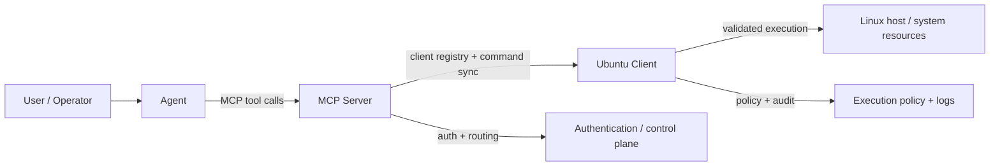

# ANAN Server Management

ANAN Server Management is a secure, policy-driven platform for managing Linux systems through an AI-assisted orchestration workflow. The project separates the user experience, command routing, and final execution enforcement into distinct layers so remote operations remain auditable, constrained, and safer than a direct shell model.

## Overview

The repository is organized as a three-part system:

- the assistant layer handles reasoning and user interaction
- the MCP server acts as the central orchestration and registry layer
- the Ubuntu client enforces runtime policies and executes only approved commands

This architecture is designed to keep command execution under explicit control while still supporting automation and remote administration.

## Architecture at a Glance



## Why this project exists

The core idea is simple: command execution should not be trusted to a higher-level interface without a final local policy check at the execution host. By enforcing a default-deny model, validating binaries and arguments, and logging execution outcomes, the platform reduces operational risk and improves accountability.

## Repository Layout

```text
anan-server-mgmt/
├── agent/                          # AI assistant / orchestration client
│   ├── README.md
│   ├── config/
│   ├── src/
│   ├── tests/
│   └── start_anan_agent.sh
├── client/
│   └── ubuntu/                    # hardened execution node
│       ├── README.md
│       ├── config/
│       ├── src/
│       ├── tests/
│       ├── install_service.sh
│       ├── uninstall_service.sh
│       └── start_anan_client.sh
├── mcp_server/                    # central control plane
│   ├── README.md
│   ├── config/
│   ├── src/
│   ├── tests/
│   └── start_mcp_server.sh
├── ARCHITECTURE.md
├── ARCHITECTURE_DIAGRAM.md
├── EXECUTIVE_SUMMARY.md
├── TECHNICAL_ARCHITECTURE.md
├── .gitignore
└── README.md
```

## Main Components

### Agent

The agent is the user-facing orchestration layer. It connects to the MCP server, selects model/provider settings, and sends tool calls for execution requests. It does not directly serve as the final execution authority.

See: [agent/README.md](agent/README.md)

### MCP Server

The MCP server is the central control plane. It maintains the registry of managed clients, exposes the command surface, routes requests, and handles authentication and synchronization with the execution layer.

See: [mcp_server/README.md](mcp_server/README.md)

### Ubuntu Client

The Ubuntu client is the enforcement boundary. It receives requests from the MCP server, validates them against a command policy, blocks unsafe operations, and executes approved commands only under strict constraints.

See: [client/ubuntu/README.md](client/ubuntu/README.md)

## Security Model

The system is intentionally conservative and built around a default-deny posture:

- unknown commands are denied by default
- commands are executed as explicit argv entries rather than via a raw shell command string
- dangerous binaries and unsafe actions are blocked unless explicitly allowed by policy
- execution requests are checked against allowlists and runtime rules
- policy files are integrity-checked for ownership and permissions
- command attempts are logged for auditing and traceability

## Typical command flow

1. A user interacts with the agent.
2. The agent calls MCP tools on the server.
3. The MCP server resolves the target client and command metadata.
4. The client validates the request against policy.
5. The client executes the approved command under safeguards.
6. Results are returned back through the MCP and agent layers.

## Key Features

- AI-guided orchestration through an MCP-based workflow
- centralized registration and command coordination
- per-client policy enforcement at the execution endpoint
- read-only and non-admin safe modes
- OAuth-enabled protection for agent-to-MCP communication when required by the deployment
- no-auth support for simple internal deployments
- Auth0-tested OAuth integration path for secure identity-based access control
- audit logging and operational traceability
- deployment-friendly service startup scripts for Linux environments

## Getting Started

For a step-by-step walkthrough, see the [Quick Start Guide](QUICK_START_GUIDE.md).

The project is designed to be run in layers, usually in this order:

1. Start the MCP server.
2. Start the Ubuntu client on the managed host.
3. Configure and launch the agent.

The agent supports flexible model integration for varying deployment needs: local LLM runtimes such as Ollama for privacy-focused, self-hosted inference; direct integration with Google Gemini for leading frontier model access; and OpenRouter for selecting from a broad range of model providers based on performance, cost, and capability requirements.

For secure agent-to-MCP communication, the platform supports OAuth-based authentication when required by the deployment. This integration has been validated with Auth0 and is suitable for enterprise environments that require identity-backed access control between the agent and the MCP server.

Each component has its own setup and runtime details in its respective README.

### Start the MCP server

```bash
cd mcp_server
./start_mcp_server.sh
```

### Start the Ubuntu client

```bash
cd client/ubuntu
sudo ./start_anan_client.sh
```

### Start the agent

```bash
cd agent
./start_anan_agent.sh
```

## Documentation

This repository includes deeper design and implementation references:

- [ARCHITECTURE.md](ARCHITECTURE.md)
- [ARCHITECTURE_DIAGRAM.md](ARCHITECTURE_DIAGRAM.md)
- [EXECUTIVE_SUMMARY.md](EXECUTIVE_SUMMARY.md)
- [TECHNICAL_ARCHITECTURE.md](TECHNICAL_ARCHITECTURE.md)

## Project Philosophy

ANAN Server Management is best understood as a three-layer security chain:

- interaction layer: the AI assistant
- orchestration layer: the MCP server
- enforcement layer: the Ubuntu client

The assistant is useful for reasoning and workflow coordination, but the final enforcement authority remains at the execution host. That separation is the central principle behind the project.

## Status

This repository is structured for secure, controlled automation across managed Linux endpoints and is intended for environments where command safety, policy enforcement, and auditability matter.

## License

This project does not currently declare a license in the repository root. If you plan to publish or distribute it publicly, add an appropriate open-source license before release.
